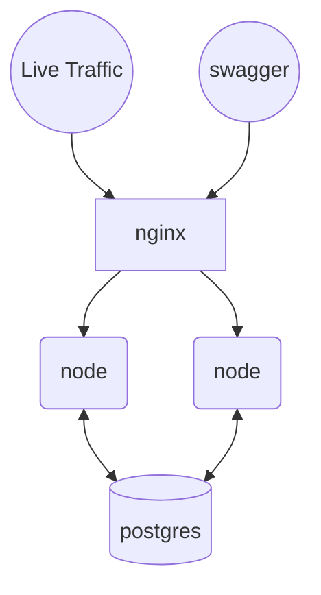
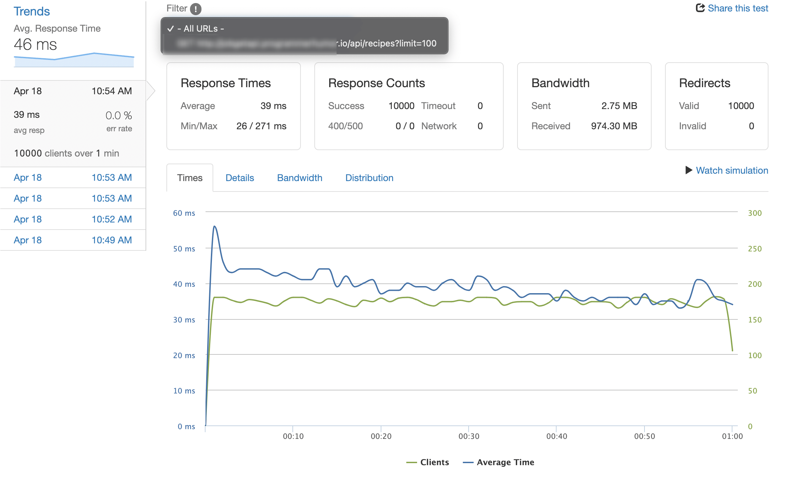
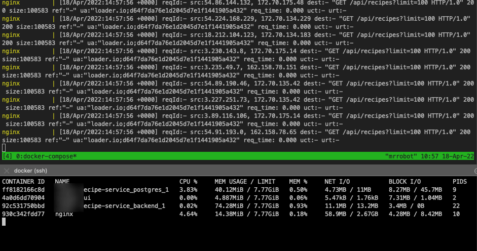

[](https://github.com/terminalbytes/nodejs-nginx/actions/workflows/app-build.yml)&nbsp;&nbsp; &nbsp; &nbsp;[](https://github.com/terminalbytes/nodejs-nginx/actions/workflows/test.yml)

# Recipe Service
  - [Introduction](#introduction)
    - [Try It Live](#try-it-live)
  - [Setup](#setup)
  - [Features](#features)
  - [Architecture](#architecture)
  - [Content Negotiation](#content-negotiation)
  - [Tests](#tests)
  - [Design Decisions](#design-decisions)
    - [Why nginx?](#why-nginx)
    - [Why find-my-way?](#why-find-my-way)
  - [Load Tests](#load-tests)
    - [Load Test Result](#load-test-result)
    - [Server Performance during load testing](#server-performance-during-load-testing)

## Introduction
A production ready, scalable backend CRUD API for managing recipes. Build with Docker, Nginx, Node.js, TypeScript, and PostgreSQL.

## Setup
Clone the repository and run
```
docker-compose --env-file .env up --build
```
###### * Depending on your setup, it could be either `docker-compose` or `docker compose` (ships with docker desktop).

Wait for the command to setup all the containers and Open Swagger UI running on the  port `8082`, i.e go to [localhost:8082](http://localhost:8082) or directly access the API on port `8084`.


## Features
- Simple to setup.
- Typescript / Strongly typed
- Fully dockerized and with some CICD support using Github Actions
- Production ready, out of the box rate limited APIs to prevent abuse
- Unit tested
- Paginated APIs
- Built without using any web/micro frameworks
- Secure access patterns and `jwt` auth
- Relational database model using PostgreSql
- Database abstraction using [sequelize](https://www.npmjs.com/package/sequelize) orm
- Content Negotiation based on `Accept` request header.
- Well documented APIs
- JSON logging which can be directly shipped to ES or Cloudwatch (when running on ECS).


## Architecture


1. Live traffic is served by the `nginx` container, which acts as a rate limiter, load balancer and reverse proxy for the `node` containers (only 1 at the moment).
2. `node` container talks to the database and serves the user request.

## Content Negotiation
The API supports content negotiation, i.e it'll automatically serve the response in the desired format. Just include the `Accept` request header with the content-type you want in the response.

Supported content types:
```
application/json  (<- default)
application/xml
text/plain
```

## Tests

After you've cloned the repository, `cd` into the `app/` directory and run the command:
```
yarn install; yarn test
```
The test file locations should mirror the targeted files in the `app/src/` directory.


## Design Decisions

### Why nginx?
We want a high availability API. Nodejs is powerful but when it comes to multiple concurrent connections it performs badly because of the single threaded nature of its event loop.
Also, rate limit logic in a Nodejs app is not at all a good idea (A DOS attack can crash a Nodejs service really easily, block the event loop for other users). Which is where nginx comes in, nginx is built for handling and rejecting requests at scale. So erroneous requests don't even make it to our backend service, nginx filters them.

### Why [find-my-way](https://www.npmjs.com/package/find-my-way)?
Well, since the requirements stated that we cannot use a web/micro framework, I only had two options, either write my own router or use something like [find-my-way](https://www.npmjs.com/package/find-my-way)/[express-router](https://www.npmjs.com/package/router).

Another major requirement was that I had to apply best security practices in this project. So writing my own router which conforms to the [RFC3986](https://datatracker.ietf.org/doc/html/rfc3986) would probably take me a year. I didn't want to do a poor job using `switch(case)` for routing, so used an existing library which provides URL sanitization and other sick features out of the box.

Also, I didn't use express-router because it provides a lot of functionality out of the box so it felt a little cheaty to me xD, find-my-way is the bare minimum (and it's [crazy fast too](https://github.com/delvedor/router-benchmark)).

## Load Tests

Here are the results from load testing the endpoint (with 100 recipes fetched every time):

```
https://example-domain.com/api/recipes?limit=100
```

Clients: `10,000 / min`

Average Response Time: `39 ms`

Bandwidth: `974 MB`


##### Load Test Result



##### Server Performance during load testing

